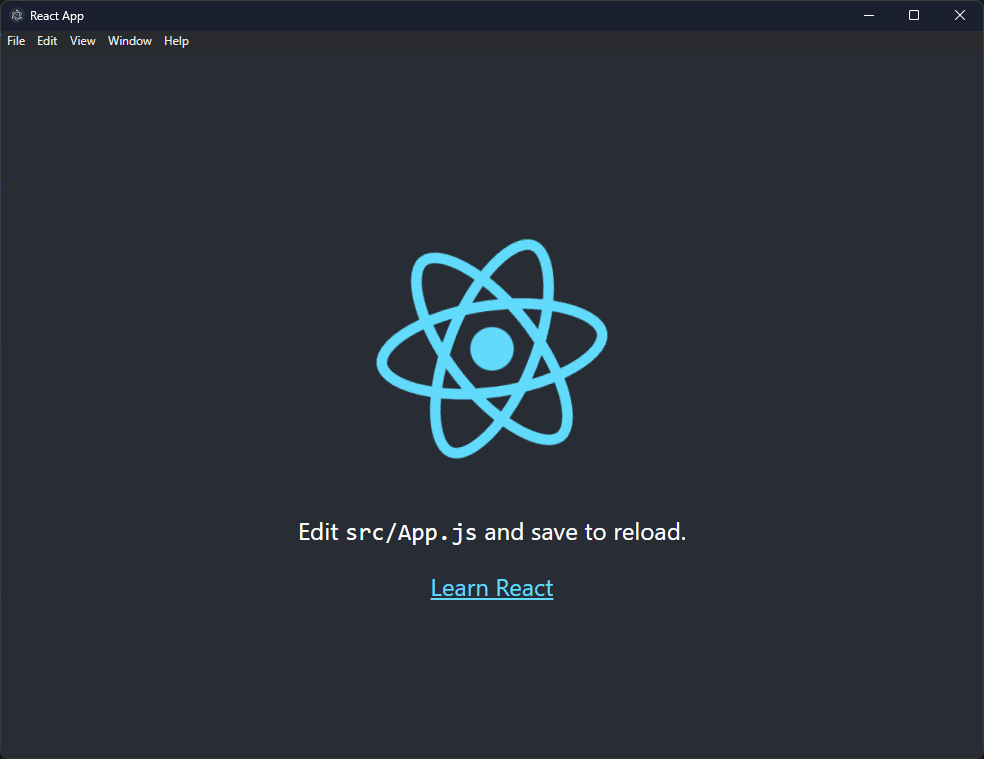
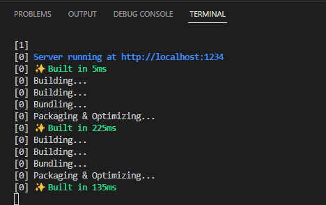

# electron-react

Boilerplate for an Electron React Application with Hot Reloading.

## Getting Started

To get started, perform the following:

1. `npm install`
2. `npm run init`
3. `npm run dev`

The above steps install both the electron and react dependencies, creates an initial build for the frontend, and then starts the app. 

### Installing Dependencies

When installing dependencies, be sure to first change into the respective folder (electron or react). Then, install as normal though npm.

## Building

To build a production ready app, simply run the following:

`npm run build`

This will output the appliation under the builds folder within the application root directory.

> Note: this requires having first ran `npm install` and `npm run init` at least once prior.

## Example

Below is what you can expect to see after running the steps under [getting started](#getting-started).

